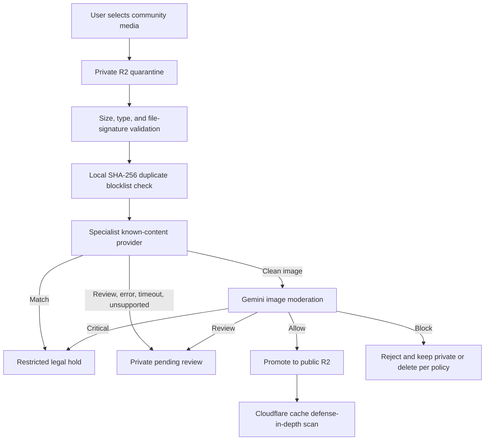

# Child Safety Provider Integration Plan

Status: Proposed implementation plan  
Last updated: September 3, 2026  
Scope: PerfectPPI community images and videos  
Primary recommendation: Microsoft PhotoDNA Cloud for still images, Gemini as the second moderation layer, and Cloudflare CSAM scanning as defense in depth

This document is an engineering and operations plan. It is not legal advice and does not by itself authorize public user-generated media launch.

## 1. Executive Decision

PerfectPPI should pursue the following path:

1. Apply to Microsoft PhotoDNA Cloud and the Tech Coalition Pathways program in parallel.
2. Use Microsoft PhotoDNA Cloud as the first production provider if PerfectPPI is approved and its transaction allowance is sufficient.
3. Keep the existing fail-closed moderation behavior until a specialist provider passes production acceptance testing.
4. Enable Cloudflare's CSAM Scanning Tool on the proxied public-media domain as an additional control, not as the primary pre-publication gate.
5. Launch public community images before public community videos. PhotoDNA Cloud currently supports still images, while videos need a video-capable provider or an approved self-hosted video hash source.
6. Retain Meta's open-source Hasher-Matcher-Actioner (HMA), a PhotoDNA sublicense, and an approved hash exchange as the preferred self-hosted fallback.
7. Do not purchase Thorn Safer Match at the current public price unless volume, risk, or video requirements justify it or Thorn offers an acceptable private startup price.

## 2. Objectives

- Prevent known illegal media from becoming publicly accessible.
- Keep uncertain, failed, unsupported, and unscanned media private.
- Use specialist known-content matching before general AI image classification.
- Minimize disclosure of uploaded media and account information to providers.
- Preserve an auditable decision trail without copying sensitive media into logs.
- Support provider replacement without rewriting the community feature.
- Establish controlled review, preservation, reporting, and incident procedures.
- Keep initial infrastructure and provider costs proportionate to launch volume.

## 3. Non-Goals

- Gemini is not treated as a replacement for verified known-content matching.
- A locally computed SHA-256 digest is not treated as a specialist CSAM scan.
- Cloudflare cache scanning is not treated as a synchronous pre-publication approval.
- Open-source perceptual hashing without an approved reference database is not treated as an operational detection system.
- Ordinary administrators must not be given access to suspected illegal-content evidence.
- PerfectPPI must never use real illegal material for development or acceptance testing.

## 4. Current PerfectPPI Foundation

The following controls already exist:

- Community media uploads enter the private R2 quarantine bucket.
- Upload reservations bind the uploader, post, expected size, and content type.
- The server retrieves and validates the object before moderation.
- Image uploads are limited to 10 MB and video uploads to 50 MB.
- Media signatures are checked rather than trusting only the declared MIME type.
- SHA-256 duplicate checks stop previously rejected or legal-hold content from being rescanned and promoted.
- The specialist scanner executes before Gemini image moderation.
- Missing configuration, provider errors, uncertain results, and unsupported formats remain private.
- Only allowed media is promoted from private quarantine to public R2 storage.
- Match results enter restricted legal hold.
- Moderation decisions and events are recorded for auditability.
- Manual approval cannot promote media unless a clean specialist scan is recorded.

Primary implementation references:

- `src/lib/moderation/child-safety.ts`
- `src/lib/moderation/policy.ts`
- `src/lib/moderation/index.ts`
- `src/features/community/actions.ts`
- `src/features/moderation/actions.ts`
- `src/lib/storage/r2.ts`

## 5. Provider Strategy

| Option | Cost position | Coverage | Recommendation |
|---|---|---|---|
| Microsoft PhotoDNA Cloud | Free for qualified and vetted organizations, subject to limits | Known still images | Preferred launch provider |
| Tech Coalition Pathways plus PhotoDNA and HMA | PhotoDNA sublicense and software can be free; hosting and operations remain | Depends on licensed algorithms and approved hash exchanges | Preferred self-hosted fallback |
| Cloudflare CSAM Scanning Tool | Enabled at the Cloudflare zone; confirm account and plan availability | Images served through Cloudflare cache | Enable as defense in depth |
| Thorn Safer Match | Public AWS Marketplace minimum is approximately USD 30,720 annually | Known images and videos; review/reporting capabilities | Too expensive for the initial stage unless privately discounted |
| Hive with Thorn | Enterprise sales process | Known-content matching and predictive classification | Obtain a quote only if PhotoDNA routes are unavailable |

### 5.1 Why PhotoDNA Cloud First

- Microsoft describes the service as free for qualified organizations.
- It avoids operating a hash index and synchronizing a protected reference database.
- It is appropriate for an early-stage, lower-volume image workflow.
- The current service is limited to still images and does not have a normal SLA.
- Approval, terms, transaction limits, and provider documentation must be confirmed before implementation is finalized.

### 5.2 Why Pathways in Parallel

- Pathways is free and specifically supports startups and smaller technology platforms.
- Eligible companies can apply for a free PhotoDNA sublicense.
- HMA provides open-source hashing, matching, indexing, and exchange integration infrastructure.
- Self-hosted matching still requires approved access to a verified hash source. PhotoDNA is an algorithm; it is not itself the protected reference database.

### 5.3 Role of Cloudflare

Cloudflare can scan images as they enter the Cloudflare cache and can block known matches where possible. PerfectPPI should enable it on the custom domain that serves public R2 media after confirming that the hostname is proxied and eligible.

Cloudflare is secondary because it does not return the synchronous `clean`, `match`, or `review` response required before PerfectPPI promotes quarantined media. It also does not replace PerfectPPI's review and reporting responsibilities.

## 6. Target Moderation Architecture



### 6.1 Production Image Path

1. The client uploads directly to private R2 using a short-lived presigned URL.
2. PerfectPPI retrieves the exact reserved object and validates size, MIME type, and file signature.
3. PerfectPPI checks its internal SHA-256 record for a prior rejected or legal-hold result.
4. The server submits the image to the approved specialist provider.
5. A known-content match enters restricted legal hold and short-circuits Gemini.
6. An explicit clean result continues to Gemini 2.5 Flash image moderation.
7. Only media allowed by both layers is copied to public R2 and exposed in the community feed.
8. Review, outage, timeout, invalid response, or unsupported media remains in private quarantine.

### 6.2 Video Path

PhotoDNA Cloud should not be represented as video coverage. Until a video-capable solution is approved:

- Public video posting remains disabled or videos remain private and pending manual review.
- A manual reviewer cannot override the missing specialist scan and publish the video.
- Frame extraction alone is not represented as complete video hash matching unless the selected provider approves that workflow.
- Future options include Thorn Safer Match, an acceptable Hive contract, or self-hosted HMA with approved video fingerprints from an authorized exchange.

## 7. Integration Design

### 7.1 Provider Interface

PerfectPPI should retain a provider-neutral internal interface:

```ts
type SpecialistScanResult = {
  verdict: "clean" | "match" | "review";
  provider: string;
  reference?: string;
};
```

Provider-specific response bodies must be validated and mapped into this interface. Unknown fields, missing fields, unexpected statuses, and ambiguous results must map to `review`, never `clean`.

### 7.2 Preferred PhotoDNA Driver

The preferred PhotoDNA Cloud implementation is a direct server-side provider driver inside the PerfectPPI backend:

- The browser and iOS app never receive PhotoDNA credentials.
- The image moves from private R2 to the PerfectPPI server and then directly to Microsoft.
- Provider credentials remain server-only.
- The provider-neutral TypeScript interface remains stable if the provider changes.
- Provider request and response bodies are not written to application logs.

The final request format and credential names must follow the documentation Microsoft supplies after approval. They must not be guessed in advance.

### 7.3 External or Self-Hosted Gateway

The existing HTTP gateway remains useful for HMA, Thorn, Hive, or a separately deployed adapter. Its current contract is:

```json
{
  "contentBase64": "<encoded media>",
  "contentType": "image/jpeg",
  "sha256": "<hex digest>"
}
```

It expects:

```json
{
  "verdict": "clean",
  "provider": "provider-name",
  "reference": "optional-provider-reference"
}
```

The current base64 body is acceptable only if the selected gateway explicitly supports the resulting payload size. A 10 MB image becomes approximately 13.3 MB when base64 encoded. A same-app serverless HTTP adapter must not be used without confirming its request-body limit.

For a separate adapter, prefer one of these designs:

1. Increase the adapter's authenticated body limit and stream/decode without persistence.
2. Send a single-use, short-lived private R2 read URL and require the adapter to fetch it.
3. Send only provider-supported perceptual hashes when the provider contract and algorithm allow local hashing.

The URL-based design must restrict hostnames, expiration, redirects, object size, and replay to prevent SSRF and credential leakage.

## 8. Environment and Secret Management

Existing gateway variables:

```env
CHILD_SAFETY_SCANNER_URL=https://scanner.example.com/v1/scan
CHILD_SAFETY_SCANNER_TOKEN=<random-shared-bearer-secret>
```

Generate a gateway token with:

```bash
openssl rand -hex 32
```

Rules:

- Store production secrets only in the Vercel or selected server environment.
- Store local server secrets only in the repository root `.env.local`.
- Never place provider credentials in `mobile-app/.env` or any `NEXT_PUBLIC_*` variable.
- Never commit credentials, provider documentation containing credentials, or test account secrets.
- Use separate development, staging, and production credentials where the provider supports them.
- Rotate the gateway token after personnel changes, suspected disclosure, or provider migration.
- Redact authorization headers and provider payloads from observability tools.

If a direct PhotoDNA driver replaces the HTTP gateway, the exact new environment variable names will be added only after the approved provider documentation is available.

## 9. Decision and Storage Rules

| Provider outcome | PerfectPPI decision | Storage state | Publicly visible | Next action |
|---|---|---|---|---|
| Explicit clean | Continue to Gemini | Private until Gemini allows | No, until both pass | Run Gemini moderation |
| Match | Legal hold | Restricted private evidence | Never | Notify authorized safety/legal owner |
| Review or uncertain | Pending review | Private quarantine | No | Authorized manual process |
| Timeout or network failure | Pending review | Private quarantine | No | Retry or investigate outage |
| Invalid provider response | Pending review | Private quarantine | No | Alert engineering |
| Unsupported image format | Pending review | Private quarantine | No | Convert through approved flow or review |
| Gemini allow after clean scan | Allow | Promote to public bucket | Yes | Record provider/model evidence |
| Gemini review or block | Review or reject | Private | No | Review, appeal, or deletion workflow |

### 9.1 HEIC and HEIF

PerfectPPI currently accepts HEIC and HEIF uploads, but the Gemini moderation policy accepts JPEG, PNG, and WebP directly. Before launch, the team must choose one of the following:

- Convert HEIC/HEIF server-side into a provider-supported format before both specialist and Gemini scans.
- Restrict community image uploads to JPEG, PNG, and WebP.
- Keep HEIC/HEIF private for manual review.

No HEIC/HEIF upload may be automatically marked clean solely because conversion or scanning failed.

## 10. Security and Privacy Requirements

- Use TLS for every provider and adapter request.
- Authenticate every external gateway request.
- Reject requests that exceed the approved media size.
- Verify declared MIME type against the file signature.
- Disable request-body logging and error-body echoing.
- Do not include usernames, email addresses, VINs, post text, or unrelated account data in specialist requests.
- Store only the provider name, provider reference, local SHA-256, decision, reason, model/version, and timestamps in ordinary audit records.
- Keep suspected-match media in the private bucket with no custom domain or anonymous access.
- Restrict legal-hold evidence to separately designated reviewers.
- Preserve legal-hold objects from normal deletion until an authorized release decision.
- Ensure account export does not expose restricted moderation evidence.
- Ensure account deletion pauses or excludes records under valid legal hold.
- Review the provider's retention, training, subcontractor, breach, geographic-processing, and deletion terms.
- Update the privacy notice and vendor map to name the selected provider and describe the actual data flow.

## 11. Legal and Operational Readiness

Before public media launch, the responsible owner and counsel must approve:

- Whether PerfectPPI is acting as an electronic service provider for applicable reporting duties.
- NCMEC CyberTipline registration and production reporting access where required.
- A written reporting decision tree and escalation deadline.
- Evidence preservation, access, chain-of-custody, and deletion procedures.
- The set of staff authorized to review or handle suspected illegal content.
- A staff safety process that minimizes unnecessary exposure to harmful material.
- Law-enforcement request validation and disclosure procedures.
- Provider terms, data-processing terms, and any required user disclosures.
- User notice and appeal rules that do not compromise investigations or preservation duties.
- Incident-response contacts covering engineering, trust and safety, privacy, and counsel.

Provider matching does not automatically satisfy PerfectPPI's reporting or preservation obligations.

## 12. Implementation Phases

### Phase 0: Applications and Ownership

- Apply to Microsoft PhotoDNA Cloud.
- Enroll in Tech Coalition Pathways and apply for a PhotoDNA sublicense.
- Request NCMEC onboarding guidance and determine Hash Sharing eligibility.
- Assign an internal safety owner, legal owner, engineering owner, and incident backup.
- Record provider contacts and application status.

Exit criterion: applications submitted and named owners accept responsibility.

### Phase 1: Immediate Defense in Depth

- Confirm the public R2 custom domain is proxied through the intended Cloudflare zone.
- Enable Cloudflare CSAM scanning and set a monitored notification address.
- Test that normal public test images remain accessible through the custom domain.
- Document Cloudflare notification and response handling.
- Keep specialist environment variables empty and retain fail-closed media behavior.

Exit criterion: Cloudflare protection is enabled where applicable without representing it as pre-publication approval.

### Phase 2: Provider Adapter

- Review the approved PhotoDNA technical and contractual documentation.
- Implement the provider driver and strict response mapping.
- Add authentication, timeout, retry, size, and content-type controls.
- Ensure no media or credentials enter logs.
- Add structured operational metrics without sensitive payloads.
- Document development, staging, and production configuration.

Exit criterion: the adapter passes unit and contract tests using provider-approved test fixtures.

### Phase 3: PerfectPPI Pipeline Integration

- Connect the provider driver to `scanForKnownIllegalContent`.
- Preserve specialist-first, Gemini-second ordering.
- Store the clean specialist result inside the moderation audit result.
- Preserve the manual-approval guard requiring a clean specialist scan.
- Add an idempotent retry path for scanner outages and pending media.
- Decide and implement HEIC/HEIF handling.
- Prevent duplicate provider charges for already completed object hashes where policy permits reuse.

Exit criterion: no media can reach the public bucket without both required approvals.

### Phase 4: Restricted Operations

- Provision legal-hold reviewers separately from ordinary administrators.
- Verify least-privilege access to legal-hold media and records.
- Implement queue alerts and escalation acknowledgements.
- Finalize reporting, preservation, removal, and provider-outage runbooks.
- Train designated staff using documentation and synthetic fixtures only.

Exit criterion: an authorized operator can process every outcome without exposing restricted evidence to unauthorized staff.

### Phase 5: Acceptance Testing

- Run unit, integration, database-policy, and end-to-end tests.
- Run controlled provider sandbox tests.
- Verify anonymous and ordinary-user denial for quarantined and legal-hold media.
- Verify that account export and deletion respect legal holds.
- Verify that scanner failures never promote media.
- Verify Cloudflare behavior using benign content and configuration checks.
- Complete privacy, security, and counsel sign-off.

Exit criterion: all launch-blocking tests and approvals are recorded.

### Phase 6: Staged Rollout

- Enable image posting for internal administrators.
- Expand to a small invited cohort.
- Monitor provider latency, failures, review queues, and R2 promotion/deletion behavior.
- Expand to all users only after the observation period meets acceptance thresholds.
- Keep public video disabled until the video phase is independently approved.

Exit criterion: image moderation is stable at production traffic with no bypass or unresolved critical alert.

### Phase 7: Video Capability

- Measure expected video volume and compare self-hosted and hosted costs.
- Apply for approved video fingerprint access where available.
- Evaluate Thorn, Hive, or HMA with approved video hash sources.
- Validate MP4 and QuickTime processing, limits, timeouts, and asynchronous workflows.
- Add a separate video acceptance test and legal review.

Exit criterion: a provider-backed specialist video scan passes acceptance testing before public video promotion is enabled.

## 13. Test Plan

### 13.1 Unit Tests

- Missing configuration returns review.
- Invalid or non-HTTPS external gateway URLs fail closed.
- Clean, match, and review responses map correctly.
- Unknown verdicts and malformed JSON fail closed.
- Timeout and network errors fail closed.
- Match short-circuits Gemini.
- Clean image proceeds to Gemini.
- Gemini failure after a clean specialist scan remains private.
- HEIC/HEIF follows the approved policy.
- Video cannot publish without approved video coverage.

### 13.2 Integration Tests

- Upload enters only the private bucket.
- Incorrect size and MIME signatures are rejected.
- Public R2 promotion happens only after an allow decision.
- Source quarantine objects are removed after successful promotion.
- Failed promotion is cleaned up or queued for retry.
- Legal-hold evidence survives ordinary account deletion.
- Ordinary administrators cannot approve media lacking a clean specialist record.
- Duplicate rejected and legal-hold hashes are stopped before provider submission.
- Provider credentials never appear in client bundles, iOS resources, logs, or API responses.

### 13.3 Provider Acceptance Tests

- Use only provider-issued test identifiers, safe fixtures, or mocked responses.
- Confirm production authentication and TLS.
- Confirm documented rate and payload limits.
- Confirm clean and match response semantics with the provider.
- Confirm provider reference IDs are safe to retain.
- Confirm outage, retry, and duplicate-request behavior.
- Confirm retention and deletion behavior contractually and operationally.

## 14. Monitoring and Alerts

Track the following without storing media content:

- Scan requests by provider and media type.
- Clean, review, match, and error counts.
- Provider latency percentiles.
- Timeout, authentication, throttling, and malformed-response rates.
- Quarantine age and pending-review queue depth.
- Promotion and cleanup failures.
- Duplicate-hash blocks.
- Legal-hold events, visible only to authorized personnel.
- Provider allowance consumption and projected monthly volume.

Alert immediately on:

- Any known-content match.
- Any attempted public promotion without a recorded clean specialist scan.
- Authentication failures that indicate expired or rotated credentials.
- Sustained provider outages or review-queue growth.
- Anonymous access to a private or quarantined object.
- Legal-hold deletion or access-control failures.

## 15. Cost Plan

### Initial Image Launch

- Microsoft PhotoDNA Cloud: expected provider cost is zero if PerfectPPI is approved and remains within the qualified free allowance.
- PerfectPPI implementation: engineering and operational work only.
- R2: existing private and public storage plus request/egress usage.
- Cloudflare: confirm availability and any account-specific cost before enabling.
- Gemini: existing image moderation usage continues after PhotoDNA returns clean.

### Self-Hosted Fallback

- PhotoDNA sublicense: potentially free through Pathways if approved.
- HMA software: open source.
- Remaining costs: compute, PostgreSQL, object access, monitoring, backups, upgrades, on-call operations, and hash-exchange integration.
- Self-hosting should be selected for control or scale, not assumed to be cheaper before measuring operational effort.

### Paid Provider Escalation

- Thorn's public AWS Marketplace minimum is approximately USD 30,720 per year for one million queries per month.
- Hive lists CSAM detection as an enterprise contact-sales product.
- Request private startup pricing only if PhotoDNA cannot meet image or future video requirements.

## 16. Rollback and Provider Migration

- Disabling or losing the specialist provider must return the system to fail-closed pending review.
- Never fall back automatically to Gemini-only publication.
- Keep provider-specific code behind the stable specialist interface.
- Store provider-neutral decisions and provider/version metadata so historical records remain understandable.
- During migration, run the new provider in non-publishing comparison mode before making it authoritative.
- Rotate credentials and revoke the old provider after migration and retention obligations are complete.

## 17. Definition of Done

Public community image launch is ready only when all of the following are true:

- A specialist provider contract or approved program access is active.
- Production credentials are stored server-side and pass authentication tests.
- Clean, match, review, timeout, outage, and malformed-response paths pass testing.
- Specialist matching always runs before Gemini for supported images.
- No image can enter public R2 without an explicit clean specialist result and an allow decision from the remaining policy.
- Private R2 and legal-hold access tests pass anonymously and for ordinary users/admins.
- HEIC/HEIF behavior is explicitly implemented and tested.
- Monitoring, alerts, retry handling, and queue ownership are operational.
- The CyberTipline/reporting and preservation runbooks are approved.
- The selected provider is reflected in the privacy notice and vendor map.
- Counsel and the accountable business owner approve the launch record.

Public community video launch has a separate definition of done and remains blocked until an approved specialist video solution passes equivalent tests.

## 18. Open Decisions

- Whether Microsoft approves PerfectPPI and what free transaction allowance applies.
- Whether to restrict community images to JPEG, PNG, and WebP or implement HEIC/HEIF conversion.
- Whether the PhotoDNA integration is direct in-process or uses an external adapter after reviewing the approved API.
- Whether PerfectPPI qualifies for NCMEC Hash Sharing access.
- Whether Cloudflare scanning applies to the exact R2 custom-domain/cache configuration.
- Expected image and video upload volume at launch and after one year.
- Who serves as primary and backup safety/legal-hold reviewer.
- Whether public video should remain disabled or launch later with a paid provider.

## 19. Primary Sources

- [Microsoft PhotoDNA Cloud Service](https://www.microsoft.com/en-us/photodna/CloudService)
- [Microsoft PhotoDNA FAQ](https://www.microsoft.com/en-us/PhotoDNA/FAQ)
- [Microsoft PhotoDNA Terms of Use](https://www.microsoft.com/en-us/photodna/termsofuse)
- [Tech Coalition Pathways](https://technologycoalition.org/programs/pathways/)
- [Meta ThreatExchange and HMA](https://github.com/facebook/ThreatExchange)
- [NCMEC Hash Sharing API](https://report.cybertip.org/hashsharing/v2/documentation/)
- [Cloudflare CSAM Scanning Tool](https://developers.cloudflare.com/cache/reference/csam-scanning/)
- [Thorn Safer Match](https://safer.io/resources/introducing-safer-essential-api-based-csam-detection/)
- [Thorn AWS Marketplace pricing](https://aws.amazon.com/marketplace/pp/prodview-dfwekn4bx4ake)
- [Hive CSAM Detection API](https://docs.thehive.ai/reference/csam-detection-combined-api-reference)

