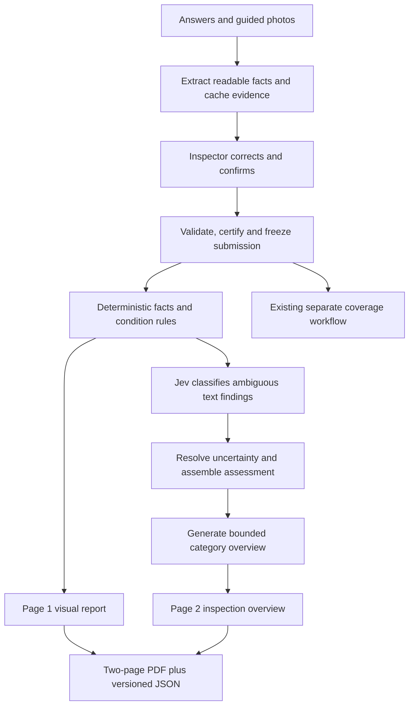

# Inspection report redesign — discovery and proposed plan

Status: discovery record updated with accepted decisions, September 22, 2026. The [developer handoff](05-developer-handoff.md), [field/rule specification](06-field-map-and-rules.md), and [delivery index](README.md) supersede provisional choices below. Templates and fictional filled examples have now been created; production application implementation has not started.

**Accepted decisions:** use separate Dents & Tires and Complete layouts; no dollar estimates; technician tread readings required and self-inspectors may explicitly mark unavailable; retain the recommended technician pressure requirement and optional brake/battery measurements; require replacement for any confirmed puncture or embedded foreign object, regardless of pressure retention; add an unchecked **Include photo evidence appendix** option that creates a separate unlimited-page PDF containing all findings and every uploaded photo. The main report remains exactly two pages.

Supporting detail: [question and flow audit](02-inspection-flow-audit.md), [report pipeline audit](03-report-pipeline-audit.md), and [primary-source research](04-research-notes.md).

## 1. Baseline and interpretation

The repository was fetched and fast-forwarded from `aa052f3` to `019fa14` on `main` before this investigation. `HEAD...origin/main` reported `0 0`. The pre-existing edit to `2026-08-04-updates/social-media-user-image-upload-compliance.md` was preserved. Findings below describe this checked-out code; no production database or deployed application was queried.

The pasted brief is the requested product specification. The attached image is a visual reference, not an instruction to reproduce its exact checklist or branding. The reference's item number and “Made in the U.S.A.” text will be omitted.

The existing product name is **Dents & Tires**, with scope `dents_tires`. The brief also calls it “dents and scratches.” This proposal assumes those references mean the existing Dents & Tires product. **Complete Inspection** remains scope `complete`.

The requested deliverable is a reusable report design and complete implementation handoff, after clarification:

- Page 1: a structured, graphical **Visual Vehicle Inspection Report**, automatically filled from inspection facts, with status marks, per-wheel measurements, and a vehicle damage diagram.
- Page 2: **Inspection Overview**, with short category-based interpretation, priorities, and next steps. No visible “AI analysis” or “AI-generated” label in the produced PDF. Existing disclosure work elsewhere is outside this redesign.
- Original layout inspired by the reference, using PerfectPPI branding, with no whole-vehicle pass/fail claim.
- Expanded tire, wheel, and body observations shared across both inspection scopes.
- Photo-assisted data entry, with inspector confirmation and explicit unavailable states.
- An accuracy certification at final submission.
- Jev used where typed categorization improves the reasoning workflow.
- A handoff containing the PDF templates, editable rendering source, completed samples, data mappings, exact question changes, pipeline changes, migration/compatibility requirements, and acceptance criteria.

## 2. Current behavior and gaps

| Area | Current implementation | Required change |
| --- | --- | --- |
| Question catalog | Fresh submissions are seeded from `src/features/ppi/constants.ts`; existing submissions store their own answer rows. Complete has 67 questions across 12 sections; Dents & Tires has 11 across 2. | A versioned catalog and shared wheel/body modules; explicit rules for old drafts and completed inspections. |
| Identifiers | Answers have row UUIDs, but semantic behavior often keys on exact English prompt text. | Stable `question_key` plus catalog version, preserving row IDs and prompt snapshots. |
| Tire measurements | Four corner tread values in whole `/32 in`, validated from 0 to 32. | Preserve original unit and precision; normalize in code; add sidewall, pressure, condition, and placard fields. |
| Tire photos | Dents & Tires requires a photo at each tread question. Complete requires one at the front-left/worst-tire prompt. | Evidence roles for each corner: tread/gauge, sidewall, DOT date, wheel, and additional damage; capture placard once. |
| Tire condition | Complete has an aggregate uneven-wear question alongside brake questions. Dents & Tires has a combined optional rim/tire text question. Neither has structured sidewall-condition fields. | Separate per-corner cracking, wear, tire damage, wheel damage, and pressure observations. |
| Body condition | Dents & Tires has six optional regional text/photo prompts. Complete has general exterior answers. | Structured damage records by panel/view/type/severity, linked to photos and diagram markers. |
| Submission | Review screen and required-answer/photo checks exist; no dedicated final accuracy attestation. | Persist an affirmative certification bound to the exact submitted revision; validate through web, mobile API, and database paths. |
| Report reasoning | Gemini receives answers and a best-effort subset of photos, returning summaries and severity findings. | Keep confirmed observations separate from inferred findings; use deterministic rules and bounded Jev classifications. |
| Photo processing | Defaults: 16 photos, 12 MB total, 45-second fetch budget. Missing/unreadable images can be skipped. | Cache extraction per image and track analyzed/unreadable/omitted evidence individually; avoid losing later wheel/body evidence to a global cap. |
| PDF | `standardized-report-pdf.ts` sends flowing text to `simple-pdf.ts`, producing a variable number of pages. | A fixed two-page renderer with measured text, vector elements, controlled content budgets, and explicit overflow handling. |
| Outputs | Resumable pipeline produces report PDF/JSON and separate coverage PDF/JSON. | Preserve job/artifact behavior and separate coverage products while introducing a versioned report schema. |
| Coverage | Dents & Tires rules depend on specific tire/body prompt strings and use tread/damage evidence. Complete uses a separate model-driven coverage stage. | Compatibility adapters and regression tests; report severity must not redefine warranty eligibility. |
| Valuation | Condition classification and coverage evaluation exist. No monetary vehicle valuation was found in the inspected pipeline. | Clarify whether “valuation” means condition evaluation, coverage, or dollar value. |

Source entry points: `src/features/ppi/constants.ts`, `src/features/ppi/answer-validation.ts`, `src/features/ppi/actions.ts`, `src/components/shared/inspection-workflow-view.tsx`, `src/features/outputs/pipeline.ts`, `src/features/outputs/inspection-photos.ts`, `src/lib/ai/standardized-generator.ts`, `src/lib/pdf/standardized-report-pdf.ts`, and `src/features/warranty/dents-tires-coverage.ts`. Companion audit files provide exact source locations and question inventories. The current PDF already has no explicit AI label; the web report's badge is a separate presentation concern.

Certification needs a guarded submission transition, not only a UI checkbox. Static source review found that `src/app/api/ppi/submissions/[id]/route.ts:33` directly updates `status`, while `20260915120000_core_vehicle_ppi_table_privileges.sql:10` and `019_ppi_rls_policies.sql:77` allow performer updates. Route transitions through validated database operations or equivalent enforcement, cover direct writes as well as API calls, and bind certification to immutable source facts. This is a source finding; no live bypass was attempted.

## 3. Proposed PDF design

Use US Letter portrait as the working assumption. Use the current brand's dark navy, restrained blue accents, white background, and dark text. Status colors should always accompany words and distinct symbols so grayscale copies remain readable. Target 9–10 pt body text, with larger section labels; prove readability in the actual rendered template. The [flow audit's 25-row mapping](02-inspection-flow-audit.md#complete-page-1--proposed-25-status-rows) maps every current Complete question into the proposed checklist, header/detail, or tire/body areas.

### Page 1: Visual Vehicle Inspection Report

Shared header: PerfectPPI, scope, report reference/version, vehicle year/make/model/trim, VIN, mileage and unit, inspection date, inspector identity and self/technician role. Values come from the frozen inspection snapshot, not model-generated identity fields or a later-edited vehicle profile.

Two variants use the same design system:

- **Complete:** a compact grouped checklist at left; wheel measurements and condition indicators at right; original vehicle line diagram with numbered damage markers; evidence completeness and inspector certification in the footer. Consolidate the 67 questions into understandable report rows without implying that absent measurements were taken.
- **Dents & Tires:** expanded four-wheel cards and damage diagram/list. Identify the narrower scope clearly; do not present engine, interior, brakes, or road test rows as checked.

Per-wheel fields: tread with original and converted units, DOT week/year, tire size, load index, speed symbol, pressure when measured, placard comparison, cracking/dry-rot level, uneven wear, tire damage, and rim damage. Use compact labels and a shared legend. Photos remain available in the digital report; the page is primarily a diagram and measurement sheet.

General status vocabulary: **Checked / Monitor / Service recommended / Urgent** with green/yellow/orange/red; separately **Not inspected**, **Unknown**, **Not applicable**, and **Outside scope**. “Not applicable” requires an actual applicability reason. Missing, skipped, unavailable, or unconfirmed evidence must never become a green check.

Dry-rot scale follows the requested four levels, with observable descriptions and example images to be settled with the rubric. Uneven wear follows the requested green/yellow/red choices. Do not silently collapse the different scales into a generic numeric score. A grouped checklist row must show any urgent finding and indicate incomplete constituent checks, even when another check in that row was completed.

Do not add battery CCA, measured brake lining, rotor thickness, alignment measurements, or every item in the reference solely to fill visual space. Add measurements only if the capture flow and inspector capability support them.

### Page 2: Inspection Overview

Use category blocks organized as **Observation → Significance → Recommended next step**, with corner/panel references. Complete can group the existing sections into Tires & Wheels; Body & Exterior; Interior & Controls; Engine & Fluids; Brakes/Suspension/Underbody; and Road Test & Diagnostics. Dents & Tires uses Tires, Wheels, Body, and Follow-up/Limitations.

Include urgent priorities first, contextual comparisons such as uneven wear alongside reported suspension symptoms, and meaningful unavailable evidence. Phrase unverified causes as possibilities to investigate. A young date code plus severe cracking should trigger a discrepancy review, not a claim that age proves misuse or that the photo proves the cause.

Final reference page budget: up to six bounded category blocks for either scope, with short paragraphs and compact action lines. Dents & Tires uses its extra blocks for fitment, unavailable measurements, and scope. Text is fitted using actual font metrics. Consolidate repeated findings; never silently remove distinct urgent issues or shrink until unreadable. Full findings/evidence stay in the authorized digital report, and the user can request a separate unlimited-page evidence appendix. A case that cannot retain all necessary urgent content within the agreed layout must be flagged for review rather than silently clipped.

### Template implementation approach

Use one programmatic layout definition for the blank template and filled outputs so fields cannot drift between an exported mockup and production. `pdf-lib` is a suitable candidate for the existing Node pipeline: it supports explicit pages, vector drawing, embedded fonts, and optional form fields without a browser runtime. Final library/version choice belongs in the handoff after a rendered prototype. [PDF-LIB capabilities](https://pdf-lib.js.org/)

The requested automatic generation does not require users to fill an Acrobat form. Deliver a blank PDF plus the editable source and mapping contract. Add interactive PDF form fields only if manual PDF completion is also needed.

## 4. Question and inspection-flow changes

### Shared wheel module for both scopes

Proposed semantic keys below are new design identifiers, not existing database columns. `{corner}` means `front_left`, `front_right`, `rear_left`, or `rear_right`.

| Key/family | Proposed capture | Validation and report behavior |
| --- | --- | --- |
| `tires.placard` | Required photo attempt of tire-information placard; editable extracted front/rear tire size and cold pressure. Capture certification label/manual specifications if load/speed information is elsewhere. | Preserve source and unreadable/missing reason. Do not assume placard contains every specification. |
| `tires.{corner}.sidewall` | Photo; brand/model if readable, size designation, numeric load index, speed symbol, relevant XL/LT marking. | Inspector confirms extracted text. Keep raw marking; compare compatible parsed fields with axle-specific references. |
| `tires.{corner}.dot_date` | Close-up of four-digit date code, or inaccessible/unreadable state. | Preserve leading zeros. Validate week/year and flag future/implausible dates. Compute approximate age in code as of inspection; do not invent an exact production day. |
| `tires.{corner}.tread` | Gauge reading, `/32 in` or mm; optional inner/center/outer values if approved. | Numeric value, original unit, method, evidence. Convert using `1/32 in = 0.79375 mm`; compare thresholds before display rounding. Preserve legacy integer behavior through an adapter. |
| `tires.{corner}.pressure` | Measured PSI or kPa, measurement context (cold/warm/unknown), optional recheck and elapsed interval. | Distinguish a single pressure reading, user-reported pressure loss, and a measured leak/recheck. One photo cannot establish that a tire holds pressure. |
| `tires.{corner}.cracking` | None / starting / significant / severe, with photo guidance; unknown available. | Four-level dry-rot indicator. Use observed condition independently of age; discrepancy is a follow-up flag. |
| `tires.{corner}.wear` | Even / uneven-monitor / severe uneven wear; optional pattern selection. | Green/yellow/red. Route severe or unexplained wear to alignment/suspension assessment without asserting a diagnosis. |
| `tires.{corner}.damage` | Multi-select cuts, missing rubber, bulge, exposed cords, foreign object, other, none observed; location and photos. | Record each defect separately. Ask depth/structural involvement and pressure-loss follow-up where relevant; unknown is valid evidence state. |
| `wheels.{corner}.damage` | None / scratches-curb rash / gouge-chipped material / bent / cracked / other; photo. | Separate cosmetic rim damage from tire damage and structural wheel concerns. |
| `tires.{corner}.fitment` | Computed axle-specific comparison and inspector confirmation of any documented alternative fitment. | Match / differs from reference / approved alternative documented / unknown. Difference is a recommendation/review flag, not an automatic whole-inspection failure. |

Technical correction: the brief's W/Y/Z examples refer to speed-related markings, while load index is typically numeric. The final question copy must keep tire size, load index, speed rating, and load-range/XL markings distinct. Authoritative tire sources and detailed repairability recommendations are recorded in the research companion.

### Body module

Keep existing body coverage traceable, but replace vague text-only completion with a per-panel status and repeatable damage items. Capture vehicle view, panel, defect type (dent/scratch/paint damage/rust/other), severity, note, evidence IDs, and optional normalized diagram coordinates. Include clear states for “no visible damage observed” and “not inspected.”

The drawing must identify left/right as vehicle left/right from the seated driver's perspective. Preserve each finding's stable ID when displaying it on either page. For vehicle body styles without matching geometry, use an explicitly generic diagram and panel list. Current Dents & Tires generation instructions exclude bumpers from inspection as well as coverage; keep that scope in the initial proposal. Adding bumper capture to that product would be a separate scope decision. Complete's proposed expanded panel capture can include bumpers.

### Complete-only additions

Reuse existing engine/fluids/interior/road-test/electrical/underbody questions. Map current answers to report rows first. Measured per-wheel brake lining, brake test values, and battery-test values are optional extensions pending clarification about tools and technician requirements. Preserve applicability for EVs, modified vehicles, and inspections without safe access to underbody components; do not infer “checked” from a section title.

### User experience

1. Identify vehicle and select scope; show tools needed and expected evidence.
2. Capture placard once, then follow a continuous physical route around the car: front-left → rear-left → rear-right → front-right, with related body panels along the route. Storage/report order can remain FL/FR/RL/RR.
3. Present one wheel card with guided camera steps. Extract readable markings while the inspector continues; show suggestions inline for correction. Require actual gauge entry for depth/pressure measurements.
4. Keep “same size/model as previous wheel” as an explicit convenience action that copies only compatible identity fields. Never copy DOT date, tread, pressure, or condition automatically.
5. Expand defect details only when a defect is selected; offer short notes or device dictation. Explain unreadable dates and inner-sidewall access without forcing fabricated entries.
6. Autosave, preserve photo upload status and allow retry. On review, show missing measurements, uncertain extraction, urgent flags, and unanswered fields together.
7. Require the inspector to confirm suggested facts and then certify the final inspection record. Store certification text/version, identity, server timestamp, submission revision, and a digest of the frozen facts. Reopening or resubmitting requires a new certification.

## 5. Proposed data and pipeline architecture

Proposed contracts:

- `InspectionFactsV2`: immutable vehicle/inspector snapshot, scope, catalog version, original typed answers, normalized wheels/placard/body/complete-check facts, applicability, evidence links, unknown reasons, and certification.
- `InspectionAssessmentV2`: findings with stable IDs, affected wheel/panel/category, observed or inferred origin, source fact/evidence IDs, rule ID or model version, action level, uncertainty, and review state.
- `InspectionReportV2`: facts + accepted assessment + bounded overview + template/rules/prompt/schema versions. Legacy report fields remain available to current clients through an adapter or additive schema evolution.
- Image extraction records: media ID/content hash, extraction model/schema version, raw recognized candidates, chosen value, evidence status, and confirmation history. Photo URLs alone are not durable provenance.

Recommended persistence is additive: extend the catalog/answer metadata for stable keys, and store validated structured facts/extractions/certification in submission-linked records or versioned JSONB with explicit server validation. Exact DDL must follow the repository's current database contracts; do not overload display text or freeform `answer_value` strings with undocumented JSON.

Never convert old missing fields to normal findings. Old completed artifacts remain available under their original schema/template version. For new-template regeneration of old inspections, show historical facts and unavailable states, with no retroactive certification. Draft upgrades must be explicit and preserve answers/photos. Existing media must keep its correct answer association.

The current resumable worker is reusable. Add independently persisted stages for extraction/normalization/assessment/overview so retries do not repay for finished work. Cache keys include submission snapshot, media content hashes, schema/rules/prompt/model/template versions as relevant. Keep artifact checksums, ownership, output versions, storage, and readiness guarantees intact. Do not let a stale response overwrite a newer revision.

A missing image may yield an unavailable observation; it may not yield an invented clean result. If Jev or the prose model is unavailable, use a documented retry/review or conservative deterministic fallback and expose that status in the application. Do not silently publish a fully reviewed assessment from an incomplete job. Keep the two-page inspection report separate from the existing coverage PDF and JSON.

## 6. Where Jev belongs

Verified against official TypeSafe documentation on September 22, 2026: Jev accepts text/structured text, not images, and returns typed decisions rather than generated prose. Current documentation identifies `jev-1.13.0`. Use a pinned, evaluated version in production. [Models](https://docs.typesafe.ai/models)

Recommended role: **semantic classification after photo extraction and fact validation, before overview composition**. It can classify an inspector's freeform note or an extracted observation into a controlled defect category, select the appropriate follow-up category, or flag a semantic contradiction needing review. Explicit form selections need no model classification. Do not ask Jev to rediscover structured facts already known.

| Responsibility | Best fit |
| --- | --- |
| Read tire markings and describe visible damage | Existing Gemini vision path, with structured extraction and human confirmation |
| Parse units, validate dates, compute age, compare tread/pressure/fitment | Application code |
| Interpret ambiguous freeform observations into allowed categories | Jev `choice` |
| Flag whether a note conflicts with confirmed evidence | Jev `noul`, plus review policy |
| Rank non-critical explanatory material where a rubric helps | Optional Jev `score`, evaluated separately |
| Apply confirmed urgent-defect rules | Application code; no model may downgrade the result |
| Write the category overview | Gemini or deterministic approved phrases for routine cases |
| Decide warranty benefits or dollar value | Existing policy workflow / separately specified valuation service; not inferred from report colors |

TypeSafe evaluates questions independently against a shared state. Batch the relevant atomic questions for a compact wheel/body/category state; dependent questions must wait for needed results. Include an explicit unknown/insufficient-evidence choice. Keep noisy photos, signed URLs, customer identity, and unrelated sections out of Jev state. [Primitives and parallel evaluation](https://docs.typesafe.ai/introduction), [Choice contract](https://docs.typesafe.ai/primitives/choice)

The official HTTP contract is `POST https://api.typesafe.ai/v1/systemone`, with bearer authentication and `model`, `state`, and `questions`. `choice` uses a `criteria` map. Validate response keys, allowed outputs, probabilities, and types at the boundary. Store credentials only on the server using `TYPESAFE_API_KEY`; the user will supply the secret securely later. [API reference](https://docs.typesafe.ai/api)

This design deliberately keeps arithmetic, date comparisons, and prose generation outside Jev; TypeSafe documents limitations in those tasks. Typed output is not proof that a classification is correct. Treat notes and OCR text as untrusted evidence, never as instructions that can alter the rubric. [Known limitations](https://docs.typesafe.ai/model-jaggedness/jev-1.13)

Start with shadow evaluation against labeled inspection examples. Measure misclassification, urgent-finding recall, abstention/review rates, unit/date accuracy, p50/p95 time, and per-report cost. Tune confidence gates per task and model version; do not copy generic provider thresholds into vehicle-safety decisions. For a user-facing safety conclusion, model confidence cannot substitute for missing measurements or inspector confirmation. [Confidence routing](https://docs.typesafe.ai/patterns/confidence-routing)

Efficiency should come from caching image extraction, batching narrow classification questions, skipping Jev for explicit answers, and avoiding repetitive prose generation. An extra classifier can increase total latency unless it replaces work; no end-to-end speed claim is justified before measuring this pipeline. Jev is not proposed as a vehicle price estimator.

## 7. Research-backed improvements

The following are product-design recommendations drawn from primary sources, not claims that those tools offer the same implementation:

- **Task-linked evidence and a focused review queue:** Tekmetric attaches photos and findings to individual tasks, separates incomplete work from checked states, and highlights urgent items. Adapt those patterns to wheel/panel cards and a review screen that takes users directly to missing or conflicting evidence. [Tekmetric inspection workflow](https://support.tekmetric.com/hc/en-us/articles/360037472154-Performing-an-Inspection)
- **Guided framing and selective retakes:** AutoVitals describes standard photo views and image review. Ask for a retake of the unreadable DOT close-up, rather than restarting a whole wheel or asking for duplicate photos. [AutoVitals photo practices](https://support.autovitals.com/hc/en-us/articles/8754627477012-AutoVitals-DVI-Photo-Best-Practices)
- **Measurements that reveal uneven wear:** Hunter's dedicated system measures across the tread. Offer inner/center/outer gauge entry when tools are available. Phone photos remain visual evidence, not an automatic tread-depth instrument. [Hunter measurement system](https://www.hunter.com/globalassets/hunter/products/vehicle-inspection/unmanned-inspection/documents/insp-qcd-wlpr-brochure-7632te.pdf)
- **One capture supporting several fields:** UVeye demonstrates grouped tire/wheel capture with specialized hardware. Use this as workflow inspiration for sidewall extraction, while independently validating this app's phone-camera capabilities. [UVeye tire and wheel workflow](https://uveye.com/wheelrestoration/)

Tire-rule corrections to carry into the handoff:

- A tire's numeric load index and letter speed symbol are distinct. [Michelin service description](https://www.michelinman.com/auto/auto-tips-and-advice/tires-101/tire-load-rating-speed-rating)
- Read the four-digit DOT week/year, preserve inaccessible dates, and compare cold pressure with vehicle guidance. Treat a placard difference as a discrepancy requiring context, including manufacturer-approved alternatives. [NHTSA TireWise](https://www.nhtsa.gov/vehicle-safety/tires)
- Front/rear specifications may differ; a documented alternate fitment needs its own state. [Michelin fitment guidance](https://www.michelinman.com/auto/auto-tips-and-advice/tire-buying-guide/performance-upgrade)
- A four-level cracking scale is our proposed product rubric. Age is context, not a formula for declaring cracking severity. Distinguish outward bulges from normal inward construction indentations. [Michelin sidewall guidance](https://www.michelinman.com/auto/auto-tips-and-advice/tire-damage/sidewall-problems)
- Exposed cords, bulges, deep structural damage, and damaged wheels warrant removal from service and professional attention; superficial missing rubber is not automatically equivalent to exposed structure. [USTMA Tire Care and Safety Guide](https://www.ustires.org/system/files/files/2024-05/Tire%20Care%20and%20Safety%20Guide%2002%2022%2019%20HR.pdf)
- Neither “holding air” nor “losing air” alone determines technical repairability; location, size, remaining condition, and internal examination matter. The user nevertheless chose a stricter program rule: require replacement for every confirmed puncture/foreign object. Apply that explicit decision without claiming that all punctures are universally irreparable. [Michelin repair criteria](https://www.michelinman.com/auto/auto-tips-and-advice/tire-maintenance/can-my-tire-be-repaired)

## 8. Implementation work packages

| Package | Existing files/surfaces to change | Proposed additions |
| --- | --- | --- |
| Catalog and facts | `src/features/ppi/constants.ts`, `answer-validation.ts`, `actions.ts`, `src/types/api.ts`, `src/types/database.ts`, `src/types/enums.ts`, new Supabase migration | Versioned semantic keys, structured wheel/body validation and normalization, legacy prompt adapters |
| Web capture/review | `src/features/ppi/hooks.ts`, `src/components/shared/inspection-workflow-view.tsx`, `inspection-step-card.tsx`, camera/upload components | Wheel/placard/body controls, suggestion confirmation, evidence states, final attestation |
| iOS/API parity | Mobile inspection views/view models/domain models and PPI API routes | The same field vocabulary, validation, review, certification, and resubmission behavior |
| Evidence extraction | `src/features/outputs/inspection-photos.ts`, `src/lib/ai/gemini.ts` | Typed extraction schema, per-photo cache/provenance, evidence-aware batching |
| Assessment | `src/lib/ai/standardized-generator.ts`, `prompts/standardized-output.ts` | `src/lib/ai/jev.ts`, `src/features/ppi/inspection-facts.ts`, `inspection-rules.ts`, versioned assessment/overview schemas (proposed paths) |
| PDF | `src/lib/pdf/standardized-report-pdf.ts`, `src/app/api/outputs/[id]/pdf/route.ts`, pipeline artifact builders | Shared layout tokens, vector body assets, fixed-page compositor, font assets, blank/filled fixtures; if rendering becomes async, await it in both artifact generation and missing-PDF fallback before hashing/uploading/responding |
| Jobs and outputs | `src/features/outputs/pipeline.ts`, `worker.ts`, output actions/queries | Persisted stages, version-aware caching, retry/overflow/review state |
| Consumers and compatibility | `standardized-output-view.tsx`, inspection results/report cards, marketplace report mapper, partner/dealer artifacts, mobile outputs | Schema adapters, complete digital detail, guarded report links |
| Coverage | `src/features/warranty/dents-tires-coverage.ts`, complete coverage generator, coverage tests | Stable fact-based adapter that preserves approved eligibility rules |
| Localization | `src/lib/i18n/messages/en-ui.ts` and existing localization structure; iOS string catalog | New field labels, status explanations, certification, report text/font coverage |

Dependency order: settle product choices → render and review templates → finalize field/report contracts → catalog/persistence and legacy adapters → capture and certification → extraction/rules/Jev → bounded overview/PDF → compatibility and end-to-end verification.

## 9. Acceptance criteria for the eventual handoff

- Exactly two report pages in each scope; neither lost content nor unintended extra pages in long-name, maximum-findings, multilingual, and unavailable-evidence fixtures.
- Page 1 values reproduce confirmed facts, including zero readings, units, all four corners, leading-zero DOT dates, axle-specific fitment, and inspector identity.
- No unsupported green checks; unknown, not inspected, not applicable, and outside scope remain distinct.
- Dry-rot, wear, cosmetic rim, and structural tire/wheel concerns have independent fields and explicit mappings.
- Confirmed urgent conditions survive grouping and overview generation. Recommendations cannot silently override deterministic rules.
- The diagram and category narrative reference the same finding IDs, corners, panels, and source evidence.
- No visible “AI analysis”/“AI-generated” label is added to the two-page PDF; preserve requested title wording.
- Certification is required server-side, bound to the submitted facts, and renewed after edits. It is never fabricated for historical records.
- Image/model failures, pending uploads, lost network connections, retries, and resubmission do not lose evidence or publish stale versions.
- Old JSON/PDF downloads and partner readiness still work. Report severity changes do not change warranty eligibility without an explicit policy update.
- Verify rendered PDFs visually and by text extraction/page count; test black-and-white printing and an appropriate PDF font strategy.
- Extend meaningful question/validation, coverage, report, database atomic submission, and mobile/API tests; run repo typecheck/lint and relevant test suites during implementation.

## 10. Decisions resolved by the user

1. **Two layouts:** one for Dents & Tires, one for Complete, with matching branding.
2. **Evaluation:** condition/priorities and existing separate warranty evaluation; no dollar estimates.
3. **Measurements:** tread required for technicians; self-inspectors can explicitly mark unavailable. The user accepted the other recommendations, including technician pressure readings and optional brake/battery measurements.
4. **Punctures:** confirmed puncture or foreign object requires replacement even when the tire holds pressure. This is the approved product rule; it overrides the earlier repairability-based recommendation without claiming every puncture is technically irreparable.
5. **Appendix:** add **Include photo evidence appendix**, default unchecked. It generates a separate PDF of full findings and all uploaded photos without a page limit. Main reports remain two pages; authorized digital detail remains available either way.

Working defaults unless changed: US Letter portrait; PerfectPPI branding; four-color action legend; certification checkbox with authenticated name, timestamp, and version rather than a drawn signature; both web and iOS included in the handoff; no monetary appraisal; no change to approved coverage benefits. Capture one explicitly measured tread reading per tire with optional inner/center/outer detail; do not relabel historical readings as a proven minimum. Use a fuller body-panel diagram with explicit not-inspected states, keeping legacy six-area mappings for old records. Dents & Tires retains its existing bumper exclusion; Complete's expanded body capture can include bumpers.

## 11. Deliverables after clarification

- Updated decision log and complete developer handoff Markdown.
- Blank one-page visual report PDF for each approved layout, plus the matching second-page overview layout.
- Filled, clearly fictional two-page examples for both scopes, including a case with tire/body concerns and one with unavailable evidence.
- Editable rendering source, original vector vehicle diagram, typography/layout tokens, field map, and fixture JSON.
- Exact old-to-new question mapping, schema/API/migration specification, Jev contract and evaluation plan, overflow rules, and a file-by-file implementation checklist.

The subsequent delivery contains reference templates, fictional samples, editable source, field/rule specifications, and a developer handoff. No production application changes, provider calls with private inspection data, credential setup, migrations, or deployment were performed. Historical audit notes remain dated records of the initial investigation.
